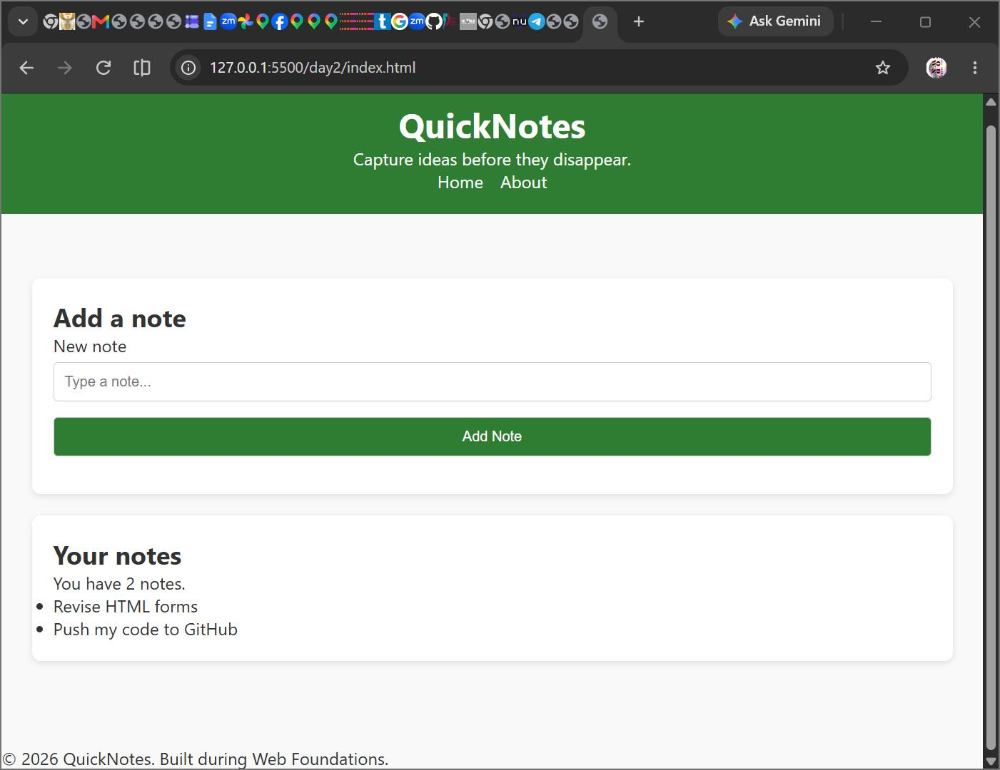
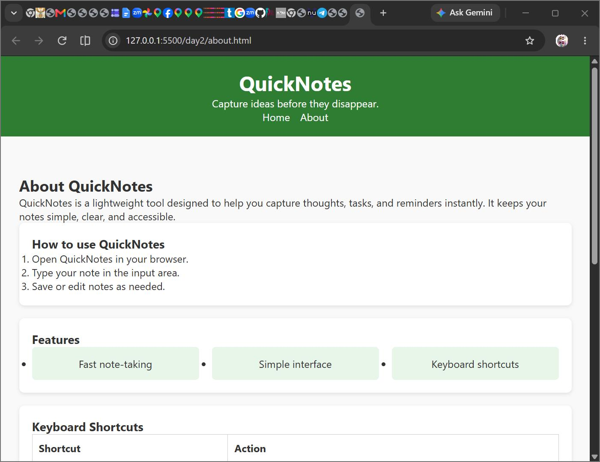
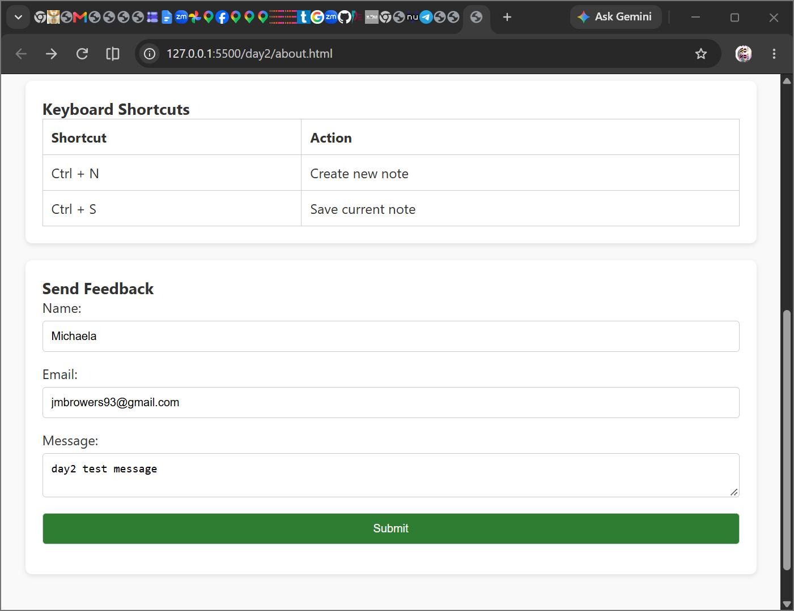

# QuickNotes — Web Foundations Day 2 Assignment

## Overview
Day 2 extends the QuickNotes project by introducing a shared stylesheet (`style.css`) to style both the Home and About pages. The assignment focused on Flexbox navigation, responsive grid layouts, styled tables, and a feedback form with transitions and media queries.

## Screenshots

**Home Page**

*Shows the note input form and saved notes list styled with Day 2 CSS.*

**About Page — Keyboard Shortcuts Table**

*Displays the shortcuts table with borders, padding, and responsive layout.*

**About Page — Feedback Form**

*Shows the styled feedback form with stacked fields, full-width inputs, and a green submit button.*

## Key Features Implemented
- Shared `style.css` linked in both pages
- Box-sizing reset and base body styles
- Flexbox navigation bar (centered, gap, hover effects)
- Responsive `<main>` layout with max-width
- Features list styled as CSS Grid cards
- Styled shortcuts table with borders and padding
- Feedback form fields stacked full-width
- Transitions on buttons and nav links
- Media query for small screens (header font size and padding)
```
---

