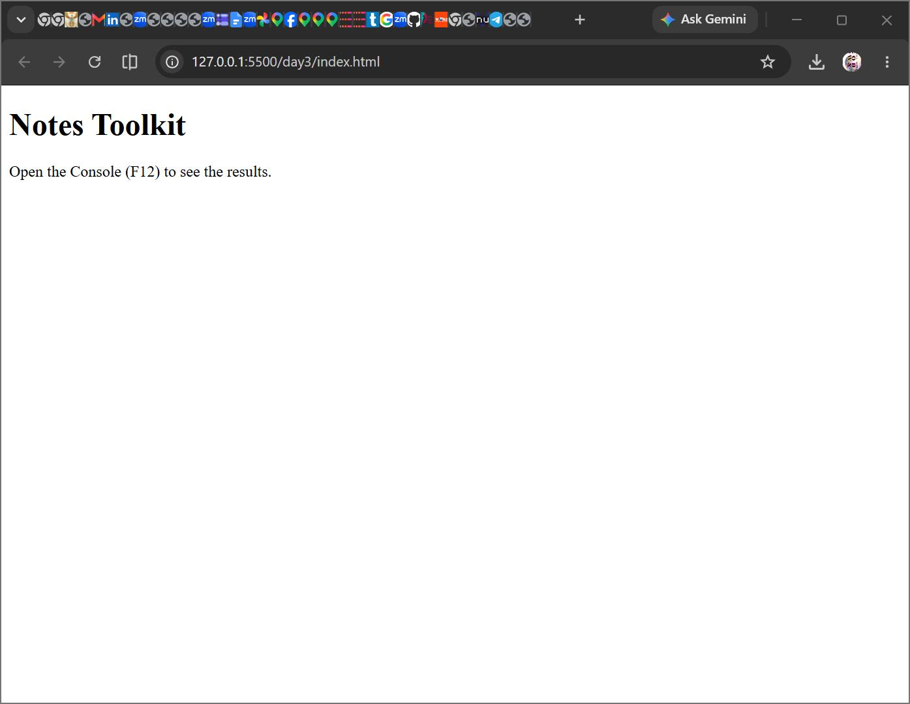
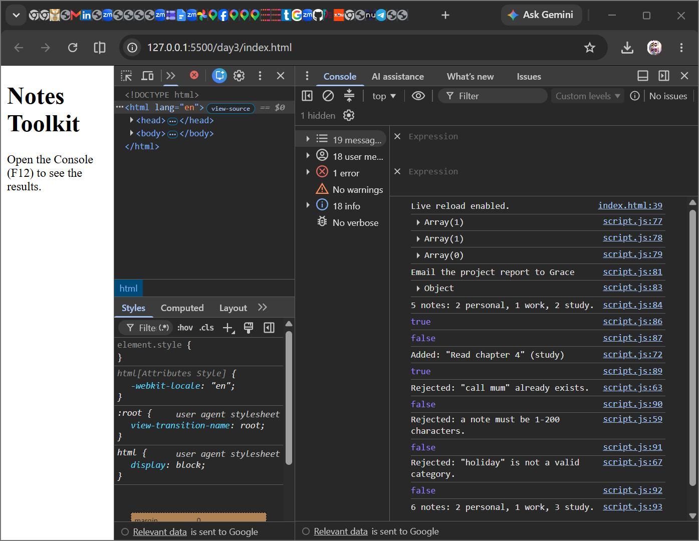

# QuickNotes — Web Foundations Day 3 Assignment

## Overview
Day 3 focuses on building the **logic layer** of QuickNotes in JavaScript.  
The HTML page is minimal and simply loads `script.js` with `defer`.  
All functionality is tested in the browser console.

## Files
- `index.html` — Minimal HTML5 page titled *Notes Toolkit*, loads `script.js` with `defer`.
- `script.js` — Contains the starting notes array and six functions:
  1. `searchNotes(word)` — Find notes containing a word (case-insensitive).
  2. `longestNote()` — Return the note with the most characters, or `null`.
  3. `countByCategory()` — Count notes per category.
  4. `getSummary()` — Build a summary sentence with singular/plural handling.
  5. `isDuplicate(text)` — Check if a note already exists (ignoring case/whitespace).
  6. `addNote(text, category)` — Add a note if valid length, not duplicate, and category is allowed.

## Testing
Each function is tested with multiple `console.log` calls.  
Expected outputs are written in comments next to each test.

Example:
```javascript
console.log(searchNotes("milk")); 
// Expected: [{ id: 1, text: "Buy milk and bread", category: "personal" }]
```

## Screenshots

**HTML Page**
 
*Shows the minimal HTML page with heading and console instruction.*

**Console Output**
 
*Demonstrates adding valid notes, rejecting invalid input, listing notes, and the summary message.*

## Summary
- Logic is complete and runs entirely in the console.
- No DOM manipulation yet — that will be connected in Day 4.
- Commit message used: **Day 3 assignment**
```

---