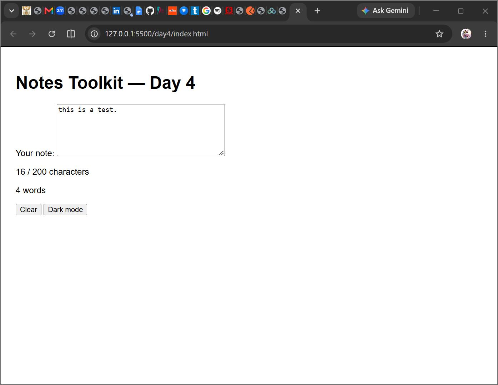

# QuickNotes — Web Foundations Day 4 Assignment

## Overview
Day 4 extends QuickNotes by connecting the JavaScript logic to the DOM.  
The page now has a live textarea, counters, a Clear button, and a Theme toggle.  
Notes are saved in localStorage and restored on refresh.

## Files
- `index.html` — Contains a labelled `<textarea id="note-text">`, character and word counters, a Clear button, and a Theme toggle button. Links `style.css` and loads `script.js` with `defer`.
- `style.css` — Defines colours as CSS variables, includes a dark theme (`body.dark`), and styles for warning (orange) and over-limit (red, bold) states.
- `script.js` — Handles live character/word counting, warning classes, draft saving/restoring with localStorage, Clear button, Escape key clearing, and theme toggling with persistence.

## Features
- **Live Counters**: Updates character and word counts on every input.
- **Warnings**: Orange text after 180 characters; red bold after 200.
- **Persistence**: Draft text and theme choice saved in localStorage.
- **Clear**: Button and Escape key reset textarea and counters.
- **Theme Toggle**: Switches between light/dark mode and remembers choice.

## Screenshot
  
*Shows the textarea with text, counters, Clear button, and Dark mode toggle.*

## Summary
- Notes update live without a submit button.
- Draft and theme persist across refreshes.
- Commit message used: **Day 4 assignment**